# ProjectU - Pixiv Kotlin Multiplatform Client

> 📱 支持平台: Android (API 24+) | Desktop (Windows/Mac/Linux)

一个功能完整的 Pixiv 客户端应用，使用 Kotlin Compose Multiplatform 开发，提供现代化的界面体验和丰富的功能。

---

## 🎯 项目简介

ProjectU 是一个开源的跨平台 Pixiv 客户端，采用最新的跨平台技术栈构建，提供完整的作品浏览、搜索、下载等功能。

### ✨ 核心特性

- 🎨 **真正的跨平台** - 一套代码，同时支持 Android 和 Desktop（Windows/Mac/Linux）
- 🏛️ **Clean Architecture** - MVI 模式 + 三层架构设计，代码结构清晰
- 🎭 **Material Design 3** - 现代化 UI，支持深色/浅色主题切换
- 🌍 **完整多语言** - 支持简体中文/繁体中文/English/日本語/한국어
- 🌐 **Pixiv Web API** - 完整集成 Pixiv Web API，支持95%以上的功能
- 🎬 **Ugoira 支持** - 完整支持 Pixiv 动图（うごイラ）的播放，支持下载为 GIF 和 MP4 格式
- 📱 **响应式设计** - 智能适配手机/平板/桌面不同屏幕尺寸
- 💾 **智能缓存** - Room 数据库 + 文件缓存系统，流畅的离线体验
- 📥 **下载管理** - 支持自定义下载路径规则和文件命名规则
- 🔍 **图片搜索** - 支持 SauceNAO 和 Ascii2d 以图搜图（Android）

## 💻 技术特点

ProjectU 使用现代化的跨平台技术栈构建：

- 🎯 **Kotlin Multiplatform** - 一套代码，多平台运行
- 🎨 **Compose UI** - 现代化的声明式 UI 框架
- 🏛️ **Clean Architecture** - 清晰的代码架构，易于维护和扩展
- 📦 **本地数据库** - 支持离线浏览和快速访问

> 📖 **面向开发者**: 详细的技术架构、API 集成和开发指南请参阅 [开发者指南](docs/DEVELOPER_GUIDE.md)

## 🚀 快速开始

### 下载与安装

**Android 用户**
- 从 [Releases](https://github.com/sunbeams001/ProjectU/releases) 页面下载最新的 APK 文件
- 安装并启动应用

**Desktop 用户**
- Windows: 下载 MSI 安装包或 ZIP 压缩包
- macOS: 下载 DMG 镜像文件
- Linux: 下载 DEB 包

> 📖 **开发者**: 如需从源码构建，请参阅 [开发者指南 - 构建和运行](docs/DEVELOPER_GUIDE.md#构建和运行)

### 登录 Pixiv 账号

首次运行应用后，需要登录 Pixiv 账号：

**推荐方式: 使用内置浏览器登录**

1. 进入应用的 **登录** 页面
2. 点击 **使用浏览器登录** 按钮
3. 在弹出的浏览器中输入 Pixiv 账号和密码
4. 登录成功后自动完成配置

**备选方式: 手动配置**

如果自动登录遇到问题：

1. 在浏览器中登录 [Pixiv](https://www.pixiv.net/)
2. 按 F12 打开开发者工具 → Application/Storage → Cookies
3. 复制 `PHPSESSID` 的值
4. 在应用设置页面中填入

配置完成后即可使用所有功能。

---

## ✨ 主要功能

### 作品浏览

- **作品详情** - 查看作品完整信息、标签、相关作品、统计数据
- **大图浏览** - 支持缩放、全屏浏览，可自定义图片质量（原图/大图/常规）
- **Ugoira 动图** - 流畅播放 Pixiv 动图，支持暂停、播放控制
- **推荐作品** - 基于作品的智能推荐，支持分页加载
- **浏览历史** - 自动记录浏览的作品、小说、系列，支持按类型筛选
- **发现模块** - 探索推荐插画、漫画、小说、用户、Pixivision 特辑
- **深度链接** - 支持从外部链接直接跳转到对应内容
- **复制 ID** - 快速复制作品/用户/小说 ID

### 搜索功能

- **关键词搜索** - 搜索插画、漫画、Ugoira、小说、用户
- **高级筛选** - 支持多种排序方式、时间范围、热门度等复杂筛选条件
- **热度预览** - 插画搜索排序支持热度预览，直观展示作品热度
- **标签搜索** - 快速按标签查找作品，点击任意标签即可跳转搜索
- **搜索历史** - 自动保存搜索历史，快速访问最近搜索
- **以图搜图** - 使用 SauceNAO 和 Ascii2d 反向搜索图片来源，支持在浏览器中打开

### 排行榜

- **插画排行榜** - 日榜、周榜、月榜、新人榜、AI 作品榜
- **小说排行榜** - 各类小说排行
- **R-18 排行榜** - 支持成人内容排行（需配置）
- **日期筛选** - 支持查看历史排行榜
- **多维度筛选** - 按内容类型（插画/漫画/动图）筛选

### 用户系统

- **用户主页** - 查看用户信息、作品列表、小说列表、收藏、关系
- **标签筛选** - 在用户页面按标签筛选插画和小说作品
- **推荐用户** - 基于特定用户的推荐，发现相似创作者
- **关注系统** - 关注/取消关注创作者
- **社交关系** - 查看关注列表、粉丝列表、好P友列表
- **关注动态** - 查看关注用户的最新作品和小说
- **快捷登录** - 内置 Webview 快速登录，或手动配置 PHPSESSID

### 收藏管理

- **作品收藏** - 收藏插画、漫画、Ugoira
- **小说收藏** - 收藏喜欢的小说
- **收藏标签** - 为收藏添加自定义标签，支持按标签筛选
- **批量操作** - 批量管理收藏

### 内容过滤（屏蔽机制）

- **R-18 过滤** - 可选择屏蔽成人内容
- **AI 作品过滤** - 屏蔽 AI 生成的作品
- **作者屏蔽** - 屏蔽指定作者的所有作品
- **标签屏蔽** - 屏蔽包含特定标签的作品
- **快捷入口** - 在作品详情页快速添加屏蔽规则

### 系列作品

- **漫画系列** - 查看完整漫画系列，支持追更
- **小说系列** - 阅读连载小说，追踪更新
- **追更列表** - 统一管理追更的漫画和小说系列

### 下载功能

- **下载路径规则** - 支持自定义下载路径，可按作品类型、作者等组织文件夹结构
- **文件命名规则** - 灵活配置文件命名规则（作品ID、标题、作者等变量）
- **Ugoira 下载** - 支持下载为 GIF 或 MP4 格式
- **下载队列** - 智能管理下载任务
- **权限管理** - Android 存储权限自动处理

### 分享功能

- **作品分享** - 分享插画、漫画和动图到其他应用
- **小说分享** - 分享小说内容到社交平台
- **多种格式** - 支持图片、文本、链接等多种分享格式

### 评论互动

- **查看评论** - 浏览作品和小说的评论
- **评论翻译** - 支持翻译评论内容
- **评论管理** - 完整的评论功能支持

### Pixivision 特辑

- **特辑浏览** - 浏览 Pixivision 官方精选的插画和漫画特辑
- **多语言支持** - 支持简体中文、繁体中文、英语、日语、韩语
- **分类筛选** - 按插画特辑和漫画特辑分类浏览

### 翻译功能

- **内容翻译** - 支持翻译插画和小说的简介
- **小说翻译** - 支持翻译小说正文内容
- **评论翻译** - 支持翻译评论区内容

### 小说阅读

- **阅读设置** - 自定义字号、文字颜色、背景色
- **阅读进度** - 自动计算和显示阅读进度
- **内部导航** - 支持小说内链接跳转

### 设置与配置

- **多语言切换** - 应用界面和 API 语言独立设置
- **主题切换** - 浅色/深色/跟随系统
- **默认启动页** - 可自定义应用启动时显示的页面
- **Pixiv 配置** - PHPSESSID 登录凭据管理
- **显示设置** - 瀑布流列数、图片质量等可自定义
- **文件命名规则** - 自定义下载文件命名格式
- **备份与恢复** - 支持备份和恢复基础设置、登录信息及其他应用数据

### 桌面小部件

- **Android 小部件** - 在桌面快速访问推荐作品（仅 Android 平台）
- **快捷入口** - 一键打开应用并跳转到特定页面

---

## 📸 应用截图

### 主要功能界面

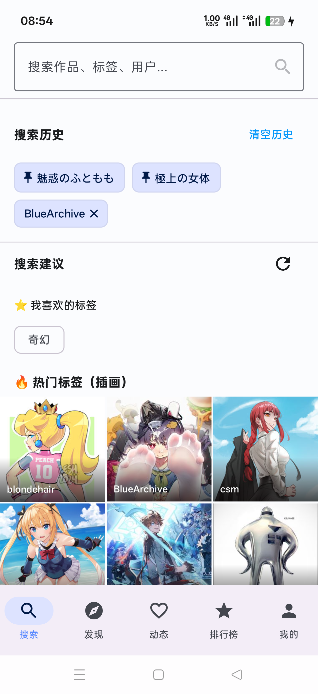 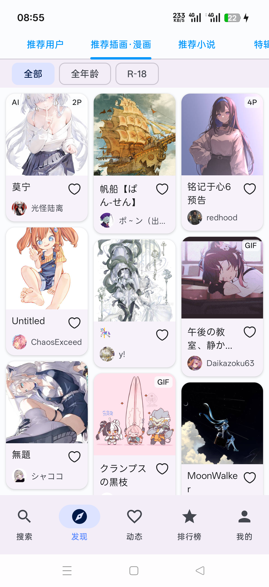 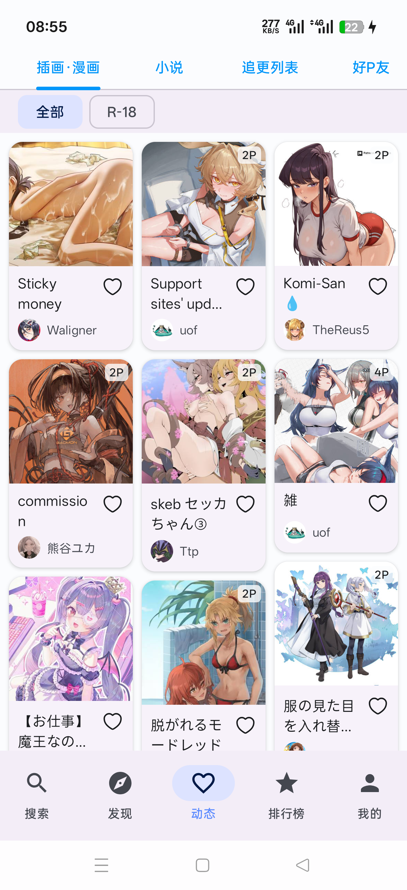

*搜索页面 | 发现页面 | 动态页面*

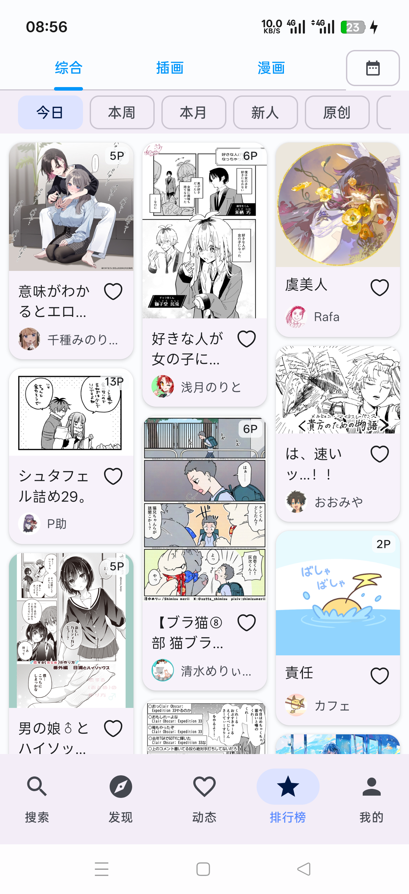 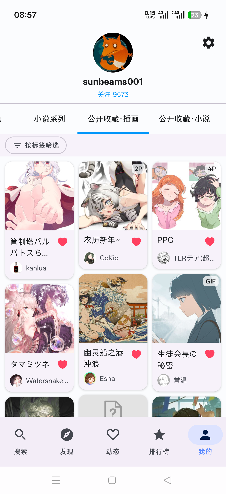

*排行榜页面 | 我的页面*

### 作品浏览

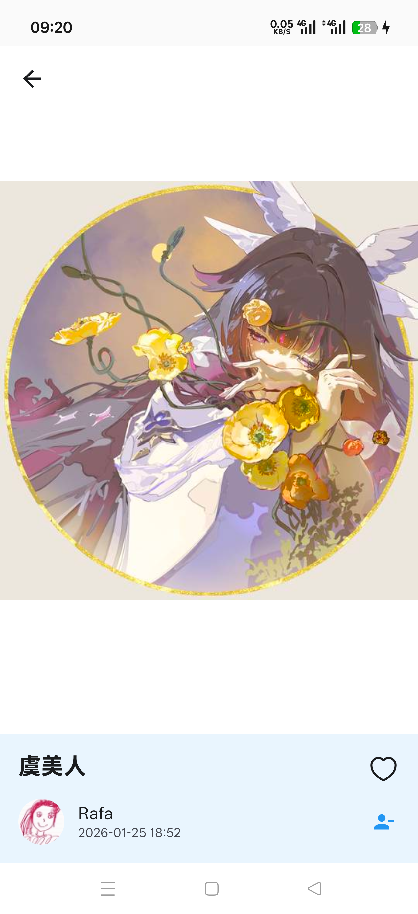 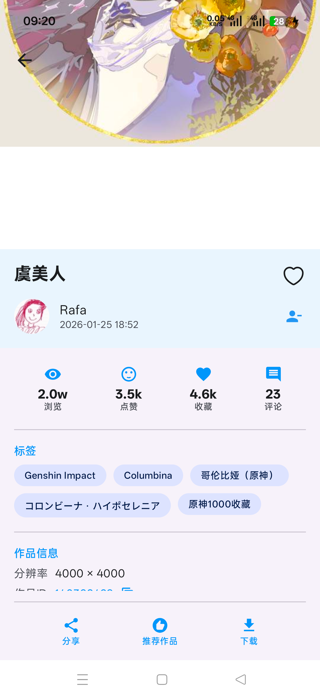 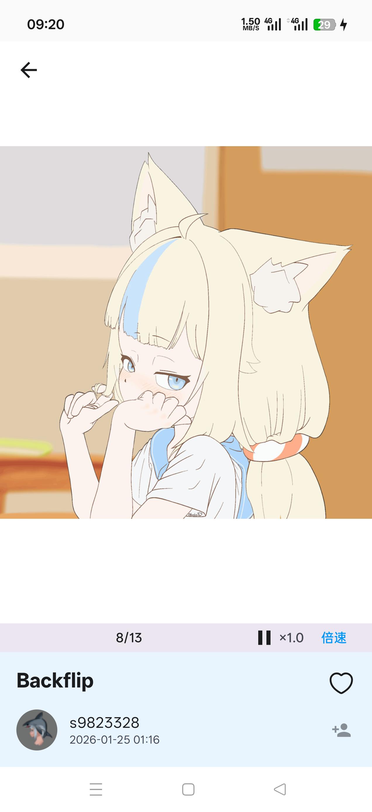

*插画详情 | 插画信息 | 动图播放*

### 小说阅读

 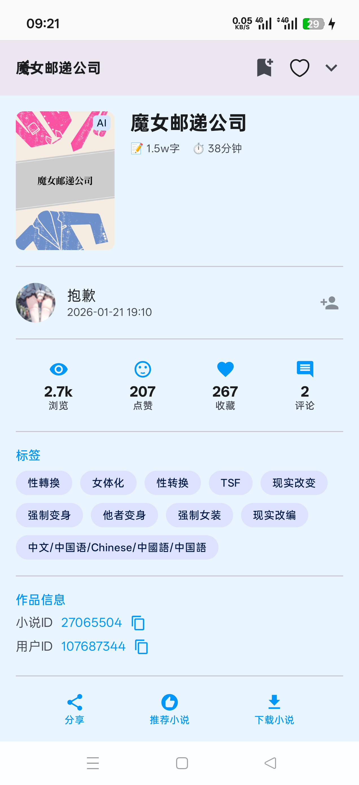

*小说详情 | 小说信息*

### 设置界面

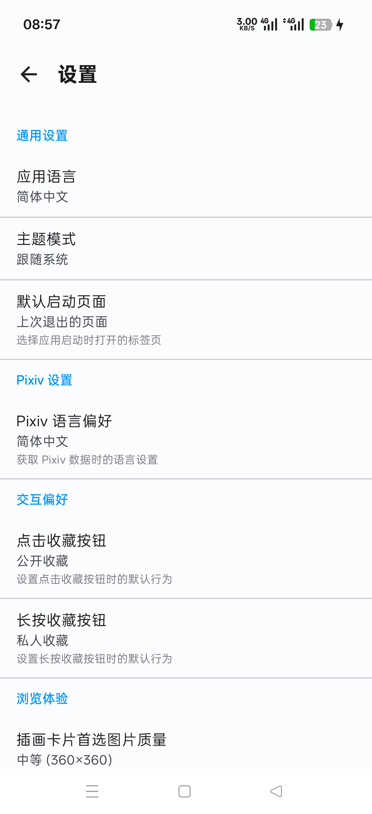 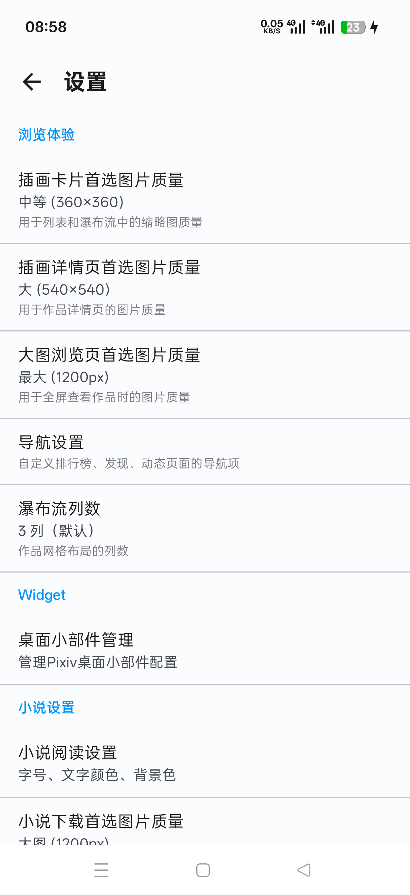 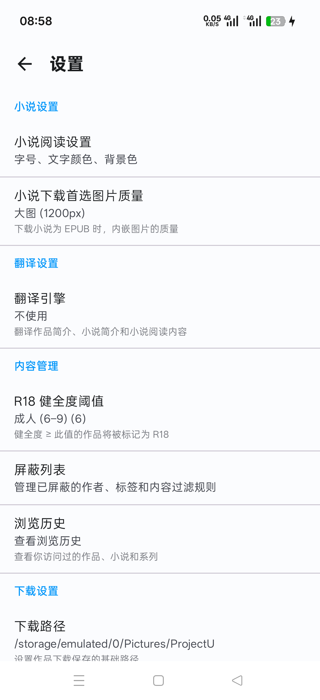 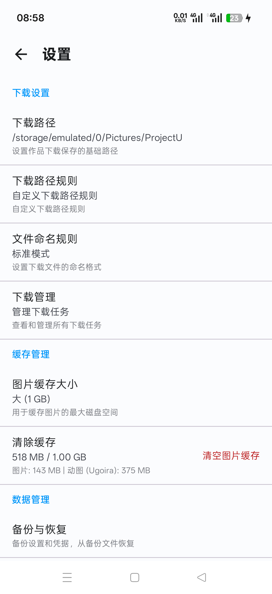

*设置页面展示*

---

## 💬 社区交流

欢迎加入 Telegram 群组，与其他用户交流使用心得、提出建议或获取帮助：

📱 **Telegram 群组**: [https://t.me/ProjectUApp](https://t.me/ProjectUApp)

---

## 🤝 参与贡献

欢迎为项目贡献代码、报告问题或提出建议！

### 贡献方式

1. **报告问题** - 在 [Issues](https://github.com/sunbeams001/ProjectU/issues) 中报告 Bug 或提出功能建议
2. **提交代码** - Fork 项目并提交 Pull Request
3. **完善文档** - 帮助改进文档和使用指南
4. **分享反馈** - 分享您的使用体验和建议

### 提交 Pull Request

1. Fork 本仓库到您的账号
2. 创建特性分支：`git checkout -b feature/AmazingFeature`
3. 提交更改：`git commit -m 'Add some AmazingFeature'`
4. 推送到分支：`git push origin feature/AmazingFeature`
5. 开启 Pull Request，描述您的更改

### 代码规范

- 遵循 Kotlin 官方代码风格指南
- 使用 MVI 架构模式组织代码
- 确保新功能同时支持 Android 和 Desktop 平台
- 添加必要的注释和文档
- 提交前运行测试确保代码质量

---

## ⚠️ 免责声明

本项目仅供学习和研究使用，请遵守 Pixiv 的服务条款和使用规则。作者不对使用本软件产生的任何问题负责。

---

## 🙏 致谢

- [Pixiv](https://www.pixiv.net/) - 提供优秀的创作平台
- [Kotlin Multiplatform](https://kotlinlang.org/docs/multiplatform.html) - 强大的跨平台技术
- [Compose Multiplatform](https://www.jetbrains.com/lp/compose-multiplatform/) - 现代化的 UI 框架
- [Koin](https://insert-koin.io/) - 简洁的依赖注入框架

---

## Star History

---

**[⬆ 回到顶部](#projectu---pixiv-kotlin-multiplatform-client)**

Made with ❤️ using Kotlin Multiplatform

